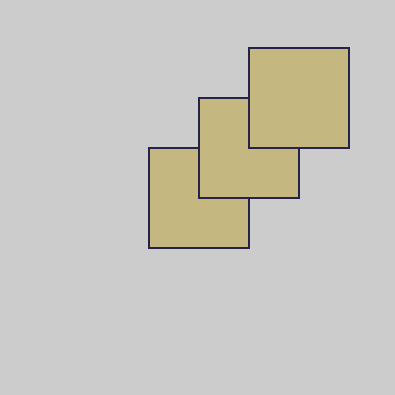

Mae `translate()` yn symud y sgrin i safle gwahanol ar sail cyfesurynnau. Bydd y siapiau ar y sgrin yn symud ond fydd eu hymddangosiad ddim yn newid. Mae trosiad yn gallu symud y sgrin yn llorweddol, yn fertigol neu'n lletraws.

Mae'r enghraifft hon yn symud y sgrin `50` i'r dde a `50` i fyny ar ôl llunio pob `rect`.

--- code ---
---
language: python
---

def draw():

  rect(150, 150, 100, 100) 
  translate(50,-50) 
  rect(150, 150, 100, 100) 
  translate(50,-50) 
  rect(150, 150, 100, 100) 

  --- /code ---

Mae'r enghraifft hon yn symud y sgrin `50` i'r chwith a `50` i lawr ar ôl llunio pob `ellipse`.

--- code ---
---
language: python
---

def draw():

  ellipse(200, 200, 100, 100) 
  translate(-50,50) 
  ellipse(200, 200, 100, 100) 
  translate(-50,50) 
  ellipse(200, 200, 100, 100)

--- /code ---

Yn yr enghraifft hon, caiff `translate()` ei ddefnyddio nifer o weithiau i lunio llygaid cymhleth heb ddyblygu'r holl god ar gyfer llygad chwith a llygad dde:
+ Yn gyntaf, mae `translate(width/2, height/2)` yn cael ei ddefnyddio i ddechrau yng nghanol y sgrin pan fydd `ellipse` ar gyfer y pen yn cael ei lunio
+ Nesaf, mae `translate(-100, 0)` yn symud `100` i'r chwith i leoli'r `llygad()` chwith
+ Nesaf, mae `translate(200, 0)` yn symud `200` i'r dde i leoli'r `llygad()` dde
+ Yn olaf, mae `translate(-100, 0)` yn symud `100` i'r chwith, yn ôl i'r canol

--- code ---
---
language: python
---

def draw():

  translate(width/2, height/2) # Symud y sgrin i'r canol 
  stroke(0, 0, 0) 
  ellipse(0, 0, 300, 300) # Pen siâp cylch
  translate(-100, 0) # Symud sgrin 100 i'r chwith ar gyfer y llygad chwith 
  eye() #llunio llygad
  translate(200, 0) # Symud sgrin 200 i'r dde ar gyfer y llygad dde 
  eye() #llunio llygad
  translate(-100, 0) # Symud y sgrin 100 i'r chwith (yn ôl i'r canol)

def llygad():

# Lliwiau llygaid
  GLAS = color(1, 32, 100) 
  DU = color(0, 0, 0) 
  GWYN = color(255, 255, 255)

# Creu llygad
  stroke(DU) 
  fill(GWYN) 
  ellipse(0, 0, 150, 150) # tu allan y llygad 
  no_stroke() 
  fill(GLAS) # iris 
  ellipse(0, 0, 80, 80) 
  fill(DU) # cannwyll llygad 
  ellipse(0, 0, 35, 35) 
  fill(GWYN, 70) 
  ellipse(-25, -20, 30, 30) # goleubwynt 
  ellipse(25, 25, 10, 10) # goleubwynt

--- /code ---
