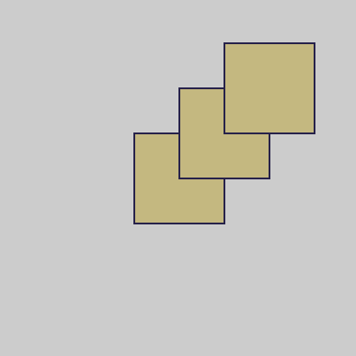
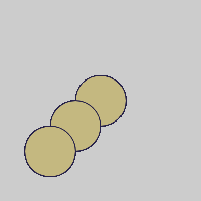
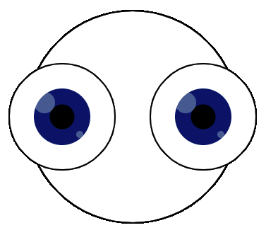

Η συνάρτηση `translate()` μετακινεί την οθόνη σε διαφορετική θέση με βάση τις συντεταγμένες. Τα σχήματα στην οθόνη θα κινούνται μαζί της αλλά η εμφάνισή τους δεν θα αλλάξει. Μια μεταφορά μπορεί να μετακινήσει την οθόνη οριζόντια, κάθετα ή διαγώνια.

Αυτό το παράδειγμα μετακινεί την οθόνη `50` προς τα δεξιά και `50` προς τα πάνω μετά από κάθε σχεδίαση του `rect`.

--- code ---
---
language: python
---

def draw():

  rect(150, 150, 100, 100)
  translate(50,-50)
  rect(150, 150, 100, 100)
  translate(50,-50)
  rect(150, 150, 100, 100)
--- /code ---

Αυτό το παράδειγμα μετακινεί την οθόνη `50` προς τα αριστερά και `50` προς τα κάτω μετά τη σχεδίαση κάθε `ellipse`.

--- code ---
---
language: python
---

def draw():

  ellipse(200, 200, 100, 100)
  translate(-50,50)
  ellipse(200, 200, 100, 100)
  translate(-50,50)
  ellipse(200, 200, 100, 100)
  
--- /code ---

Σε αυτό το παράδειγμα, το `translate()` χρησιμοποιείται πολλές φορές για να σχεδιάσει περίπλοκα μάτια χωρίς να αντιγράψει όλο τον κώδικα για ένα αριστερό και ένα δεξί μάτι:
+ Αρχικά, το `translate (width/2, height/2)` χρησιμοποιείται για να ξεκινήσει από το κέντρο της οθόνης όπου σχεδιάζεται μια `ellipse` για το κεφάλι
+ Στη συνέχεια,  το `translate(-100, 0)` μετακινείται `100` προς τα αριστερά για να τοποθετήσει το αριστερό `eye()`
+ Στη συνέχεια, το `translate(200, 0)` μετακινείται `200` προς τα δεξιά για να τοποθετήσει το δεξί `eye()`
+ Τέλος, το `translate(-100, 0)` μετακινείται `100` προς τα αριστερά, πίσω στο κέντρο

--- code ---
---
language: python
---

def draw():
  
  translate(width/2, height/2) # Μετακίνησε την οθόνη στο κέντρο 
  stroke(0, 0, 0)
  ellipse(0, 0, 300, 300) # Κεφάλι σε σχήμα κύκλου
  
  translate(-100, 0) # Μετακίνησε την οθόνη 100 προς τα αριστερά για το αριστερό μάτι
  eye() #σχεδίασε ένα μάτι
    
  translate(200, 0) # Μετακίνησε την οθόνη 200 προς τα δεξιά για το δεξιό μάτι
  eye() #σχεδίασε ένα μάτι
  
  translate(-100, 0) # Μετακίνησε την οθόνη 100 αριστερά (πίσω στο κέντρο)

def eye():

# Χρώματα ματιών
  BLUE = color(1, 32, 100)
  BLACK = color(0, 0, 0)
  WHITE = color(255, 255, 255)

# Δημιούργησε ένα μάτι
  stroke(BLACK)
  fill(WHITE)
  ellipse(0, 0, 150, 150) # εξωτερικό του ματιού
  no_stroke()
  fill(BLUE) # ίριδα
  ellipse(0, 0, 80, 80)
  fill(BLACK) # κόρη του ματιού
  ellipse(0, 0, 35, 35)
  fill(WHITE, 70)
  ellipse(-25, -20, 30, 30) # λαμπύρισμα
  ellipse(25, 25, 10, 10) # λαμπύρισμα

--- /code ---
