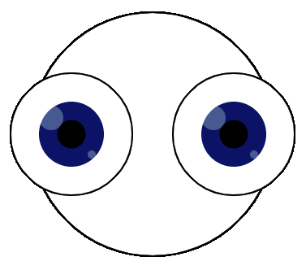

`translate()` переміщує екран в інше положення залежно від координат. Фігури на екрані будуть переміщатися, але їх зовнішній вигляд не буде змінюватися. Можна переміщати екран по горизонталі, вертикалі або діагоналі.

У цьому прикладі екран переміщується на `50` праворуч та `50` вгору, після того, як всі квадрати `rect` будуть намальовані.

--- code ---
---
language: python
---

def draw():

  rect(150, 150, 100, 100) translate(50,-50) rect(150, 150, 100, 100) translate(50,-50) rect(150, 150, 100, 100) --- /code ---

У цьому прикладі екран переміщується на `50` ліворуч та `50` вниз, після того, як всі овали `ellipse` будуть намальовані.

--- code ---
---
language: python
---

def draw():

  ellipse(200, 200, 100, 100) translate(-50,50) ellipse(200, 200, 100, 100) translate(-50,50) ellipse(200, 200, 100, 100)

--- /code ---

У цьому прикладі `translate()` використовується декілька разів для малювання очей, без дублювання всього коду для лівого та правого ока:
+ Спочатку використовується `translate(width/2, height/2)`, щоб почати з середини екрана, де малюється овал `ellipse` для голови
+ Далі, `translate(-100, 0)` переміщує на `100` вліво, щоб розташувати ліве око `eye()`
+ Далі, `translate(200, 0)` переміщує на `200` вправо, щоб розташувати праве око `eye()`
+ Наостанок, `translate(-100, 0)` переміщує на `100` вліво, назад до центру

--- code ---
---
language: python
---

def draw():

  translate(width/2, height/2) # Move screen to the middle stroke(0, 0, 0) ellipse(0, 0, 300, 300) # Circle shaped head

  translate(-100, 0) # Move screen 100 left for left eye eye() #draw an eye

  translate(200, 0) # Move screen 200 right for right eye eye() #draw an eye

  translate(-100, 0) # Move screen 100  left (back to the middle)

def eye():

# Кольори очей
  BLUE = color(1, 32, 100) BLACK = color(0, 0, 0) WHITE = color(255, 255, 255)

# Створення ока
  stroke(BLACK) fill(WHITE) ellipse(0, 0, 150, 150) # eye outside no_stroke() fill(BLUE) # iris ellipse(0, 0, 80, 80) fill(BLACK) # pupil ellipse(0, 0, 35, 35) fill(WHITE, 70) ellipse(-25, -20, 30, 30) # catchlight ellipse(25, 25, 10, 10) # catchlight

--- /code ---
